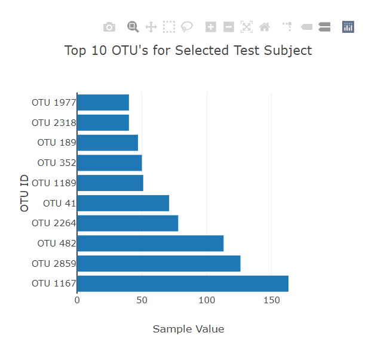
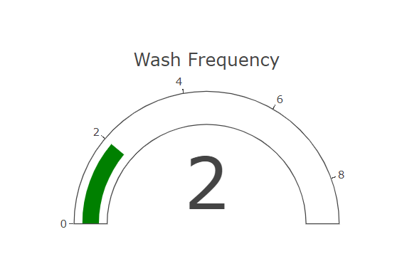
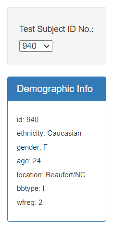
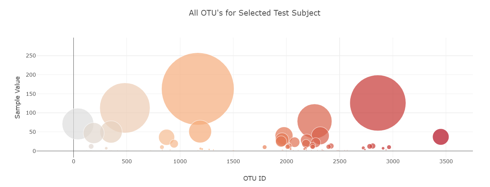

# Belly Button Biodiversity

 

Welcome to my project repo! 
You can visit the website [here](https://kirstiemccown.github.io/Plot.ly-Homework/), or feel free to take a look around the repo folders! 
When you visit the website, you will find an interactive dashboard where you can observe information about microbes that colonise human navels! 

If you are interested, you can find out more information about the study that this data was obtained from here: [Belly Button Biodiversity dataset](http://robdunnlab.com/projects/belly-button-biodiversity/)

## About the Dashboard

The dashboard will provide you with an insight to each test subject(s) results, from the Belly Button Biodiversity study. 
By selecting a test subject ID number from the available drop down menu, you will be shown three interactive charts and all demographic information for the selected test subject. 

### The Charts 
There are 3 different types of charts available to view, the first is a bar chart which shows the top 10 OTU's (operational taxonomic units), found on the selected test subject
 

The second is a gauge of the Wash Frequency of the selected test subject, showing how many times per week the individual washed their belly button
 

This statistic is also reflected in the Demographic Information, which provides you with more details about the selected test subject 
 

Finally there is an interactive bubble chart, that allows you to see all OTU's that were found on the selected test subject over the course of the study.
 

### Created With
This project was created using the following: 
* Plotly
* JavaScript
* Bootstrap
* HTML
* CSS

#### Project Instructions 

In this assignment, you will build an interactive dashboard to explore the [Belly Button Biodiversity dataset](http://robdunnlab.com/projects/belly-button-biodiversity/), which catalogs the microbes that colonize human navels.

The dataset reveals that a small handful of microbial species (also called operational taxonomic units, or OTUs, in the study) were present in more than 70% of people, while the rest were relatively rare.

#### Step 1: Plotly

1. Use the D3 library to read in `samples.json`.

2. Create a horizontal bar chart with a dropdown menu to display the top 10 OTUs found in that individual.

* Use `sample_values` as the values for the bar chart.

* Use `otu_ids` as the labels for the bar chart.

* Use `otu_labels` as the hovertext for the chart.

3. Create a bubble chart that displays each sample.

* Use `otu_ids` for the x values.

* Use `sample_values` for the y values.

* Use `sample_values` for the marker size.

* Use `otu_ids` for the marker colors.

* Use `otu_labels` for the text values.

4. Display the sample metadata, i.e., an individual's demographic information.

5. Display each key-value pair from the metadata JSON object somewhere on the page.

6. Update all of the plots any time that a new sample is selected.

Additionally, you are welcome to create any layout that you would like for your dashboard. An example dashboard is shown below:

#### Advanced Challenge Assignment (Optional)

The following task is advanced and therefore optional.

* Adapt the Gauge Chart from <https://plot.ly/javascript/gauge-charts/> to plot the weekly washing frequency of the individual.

* You will need to modify the example gauge code to account for values ranging from 0 through 9.

* Update the chart whenever a new sample is selected.

#### Deployment

* Deploy your app to a free static page hosting service, such as GitHub Pages. Submit the links to your deployment and your GitHub repo.

* Ensure your repository has regular commits (i.e. 20+ commits) and a thorough README.md file

#### Hints

* Use `console.log` inside of your JavaScript code to see what your data looks like at each step.

* Refer to the [Plotly.js documentation](https://plot.ly/javascript/) when building the plots.

#### About the Data

Hulcr, J. et al.(2012) _A Jungle in There: Bacteria in Belly Buttons are Highly Diverse, but Predictable_. Retrieved from: [http://robdunnlab.com/projects/belly-button-biodiversity/results-and-data/](http://robdunnlab.com/projects/belly-button-biodiversity/results-and-data/)

